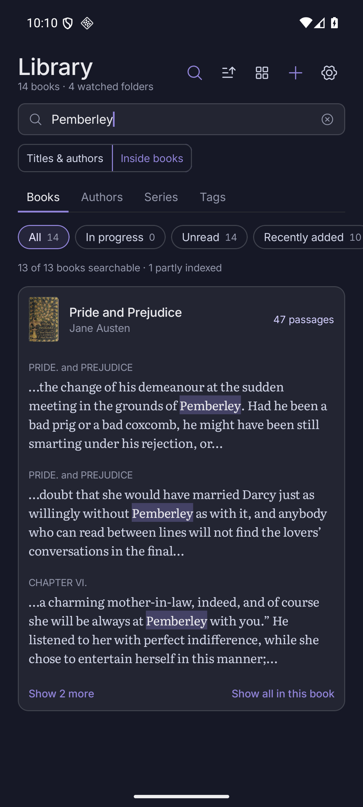
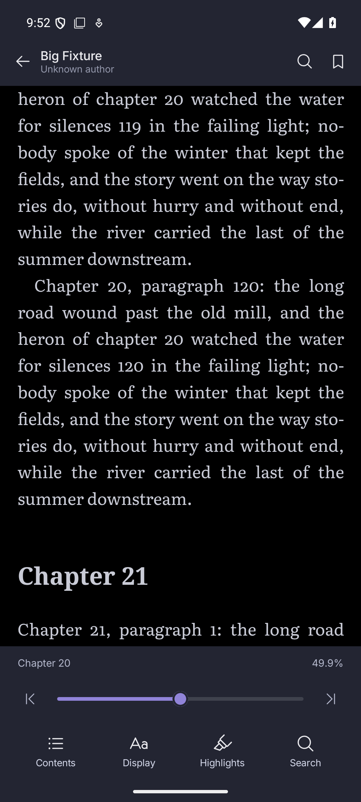
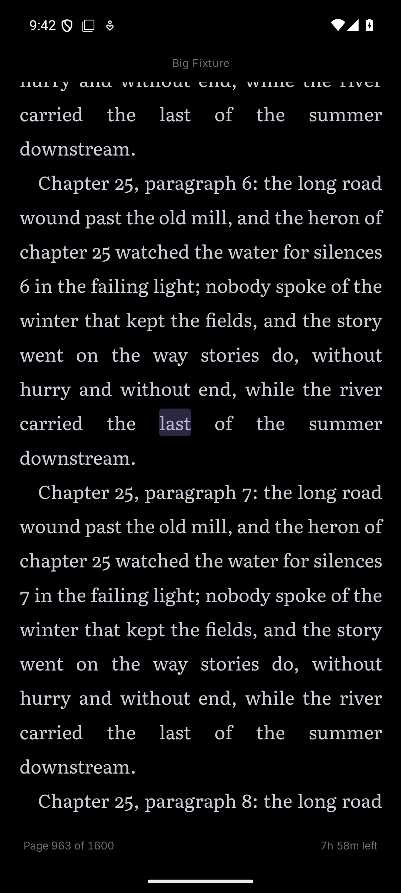
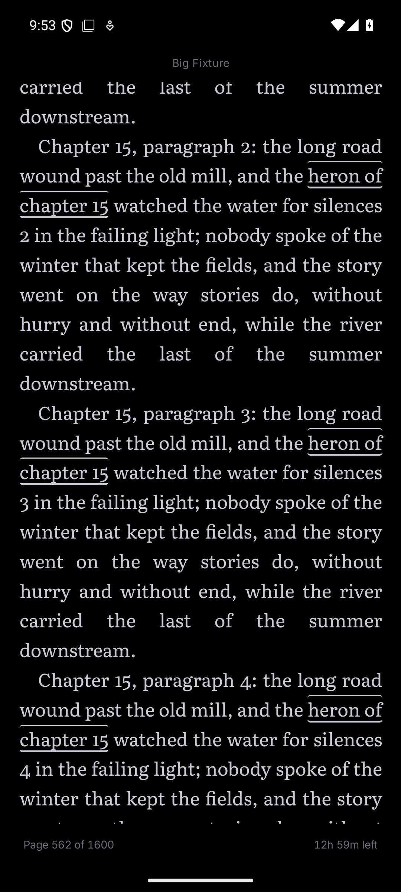
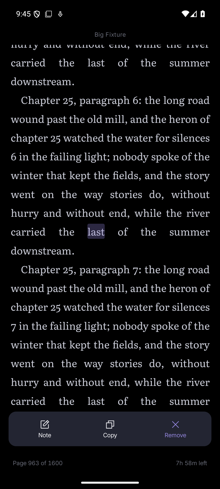
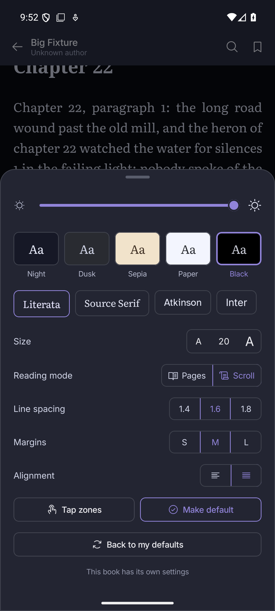
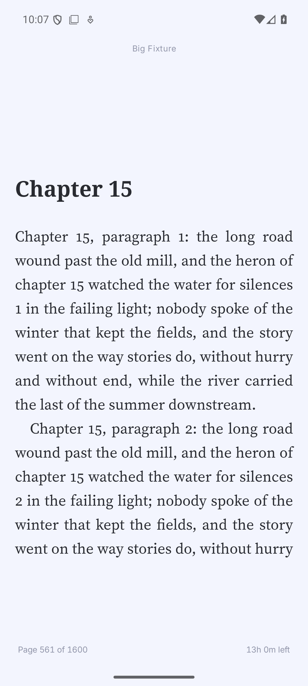

<div align="center">

# Quire

**A calm EPUB reader for Android, built for large Calibre libraries.**

[](https://github.com/sekhnat/Quire/actions/workflows/build.yml)


</div>

Quire is a quiet replacement for Librera and Moon+ Reader. It watches the folders where you keep your books, understands the metadata Calibre writes next to them, and stays fast with a thousand books or more. Reading comes first: pick a book, tap the edges to turn pages, and get on with it.

## Features

### Your library, without the import step
- **Point it at folders.** Quire finds EPUBs in your Calibre library, `Books`, `Downloads`, or any folder you choose, and picks up new files on its own (when you open the app, and every six hours in the background).
- **Calibre-aware.** Reads each book's `metadata.opf` and `cover.jpg`: series and book number, tags, ratings, description, and the date you added it. Your Calibre library is never modified.
- **Fast at scale.** About 100 books a second on first scan; a rescan with nothing changed takes half a second for 1,500 books. Only new or changed files are read.
- **Browse the way you think.** Books, Authors (with an A–Z rail), Series (with the volumes you're missing), and Tags. Grid, dense list or shelves; sort by recently opened, date added, publication date, file size or length; filter and search across titles, authors, series and tags.
- **Picks up where you left off.** A "Continue reading" card with time left, and every book remembers its place.

### Search inside every book

- **One search box for the whole library.** Quire indexes the text of your books in the background: it steps aside while you read, can be told to work only while charging, and resumes where it left off. Results group by book with passage counts, chapter labels and highlighted excerpts, and opening one jumps straight to the passage. Filter by author, series, tag or reading status as you type, and order the books by **relevance** (the default: the best-matching passage first) or by how many passages each has.
- **Chinese, Japanese and Korean work too.** Any run of CJK characters matches wherever it sits in a sentence, one character is enough to search, and it can be mixed with other words in the same query.
- **Honest about what it can find.** Counts are exact up to 50,000 passages and then read "N+", and a prefix of a very common word falls back to the exact word with a note. While the index is still being built the search screen says how much of the library is searchable, so a thin result is never mistaken for "it is not in my library".

Search has limits worth knowing: Latin-script words match as whole indexed tokens; a phrase, or two words that must both appear, only matches when it sits inside one indexed passage (a passage is about 1,000–1,500 characters and never crosses a chapter), or runs across the split of a single long paragraph, so a phrase that starts at the end of one paragraph and ends at the start of the next can be missed when the two fall in different passages; a book whose text passes 6 MiB is only partly indexed, and a book with chapters that cannot be read (a damaged file) is indexed without them and shown as partly indexed; and the first pass over a large library takes a while (about 76 minutes for 1,500 books on the test emulator, almost all of it reading the EPUBs). The index is about 1.6 times the size of the text it covers (1.6 GB for 1,500 books).

After updating from a version that kept the index inside the library database, Quire indexes the library again from scratch into its new index and removes the old one in the background; until that finishes the search screen shows how much is searchable. Settings → Rebuild index does the same on demand.

If you used text search before books with self-closing `<title/>` tags were handled, run Settings → Rebuild index once: books indexed earlier are not read again on their own.

### A reader that stays out of the way
- **Real EPUB rendering** through the [Readium toolkit](https://github.com/readium/kotlin-toolkit): images, tables, footnotes, internal links and publisher CSS all work.
- **Tap zones.** Left edge back, right edge forward, middle for the controls.
- **Pages or scroll.** Scroll mode is one continuous column for the whole book: chapter changes are invisible and one drag or fling runs through them. Only the chapters near you are kept loaded, so a 550-chapter, 90 MB book opens in about a third of a second and stays around 400-500 MB of renderer memory however far you read; the rest of the book is empty space of the right height until you get there. The tap zones step by a screen. A very fast fling can briefly outrun loading, and the contents jump to any chapter at once.
- **Make it yours.** Five themes including **AMOLED Black** (true `#000000`), four fonts (Literata, Source Serif, Atkinson Hyperlegible, Inter), size, line spacing, margins, alignment, and a brightness dimmer. Set your **reading defaults** once in Settings (theme, font, size, spacing, margins, alignment, pages or scroll) with a live preview; any single book can override them, and "Back to my defaults" undoes that.
- **Highlights, notes and bookmarks.** Select text to highlight it or attach a note; everything is listed in one place and tied to the page.
- **Search the whole book.** Results stream in as they are found, and the matches are underlined on the page.
- **Contents with real page numbers**, even for books that keep every chapter in one file.

## Screenshots

| Welcome | Pick folders | Library ready |
|:---:|:---:|:---:|
|  |  |  |

| Library | Shelves | Dense list |
|:---:|:---:|:---:|
|  |  |  |

| Authors | Series | Tags |
|:---:|:---:|:---:|
|  |  |  |

| Book page | Sort | Add books |
|:---:|:---:|:---:|
|  |  |  |

| Reading | AMOLED Black | Display settings |
|:---:|:---:|:---:|
|  |  |  |

| Contents | Search in book | Search inside books |
|:---:|:---:|:---:|
|  |  |  |

| Scroll: chapter seam | Scroll: highlight | Scroll: search hit |
|:---:|:---:|:---:|
|  |  |  |

| Scroll: highlight actions | Scroll: reflow keeps the place | Paged mode after switching |
|:---:|:---:|:---:|
|  |  |  |

## Install

Every push to `main` builds a **release-signed APK**: open the latest run on the [Actions tab](https://github.com/sekhnat/Quire/actions/workflows/build.yml), download the **quire-release-apk** artifact, and install it. A newer build installs over any older one without losing your library. Tagged releases (`v*`) attach the same APK to a [GitHub release](https://github.com/sekhnat/Quire/releases), along with the R8 `mapping.txt`. Pull-request runs still produce a debug APK. If you previously installed a debug build, you'll need to uninstall it once before the signed releases can take over.

On first launch Quire asks for **All files access**. This is a single switch in Android's settings, and it is what lets Quire read your Calibre folder in place and notice new books. Nothing leaves your phone: Quire has no network features and no account.

## Build from source

You need JDK 21 and the Android SDK (platform 36, build tools 36.0.0).

```sh
./gradlew assembleDebug test lint     # build, run the unit tests, lint
./gradlew installDebug                # install on a connected device or emulator
```

The debug APK lands in `app/build/outputs/apk/debug/app-debug.apk`.

```sh
./gradlew assembleRelease             # R8-minified release variant
```

The release APK lands in `app/build/outputs/apk/release/app-release.apk`. It is minified with R8 (see `app/proguard-rules.pro` for the keep rules). Without the `QUIRE_KEYSTORE_FILE`/`QUIRE_KEYSTORE_PASSWORD`/`QUIRE_KEY_ALIAS`/`QUIRE_KEY_PASSWORD` environment variables it is signed with the debug key; CI sets them from the repository secrets and signs with the release keystore. CI also passes `-PversionCode` (the run number) and `-PversionName` (the tag or `dev-<sha>`); locally these default to `1` and `1.0`.

To try it on an emulator, grant access and put some books on the device:

```sh
adb shell appops set com.quire.reader MANAGE_EXTERNAL_STORAGE allow
adb push my-books/ /sdcard/Books/
```

## How it's put together

```
app/src/main/java/com/quire/reader/
├── data/
│   ├── db/        Room: books, tags, reading state, bookmarks, highlights
│   ├── index/     library text search: FTS5 chunks, CJK bigrams, background indexer, grouped search
│   ├── scan/      folder scanner, Calibre OPF parser, cover thumbnails, background worker
│   ├── LibraryRepository.kt, SettingsStore.kt, ReaderPrefs.kt
├── navigator/     vendored Readium EPUB navigator (WebView), extended for exact-passage navigation
├── reader/        Readium wrapper: session, navigator host, preferences, scroll readiness
├── theme/         Nocturne design tokens, fonts, reader themes
└── ui/            Compose screens: onboarding, library, book page, reader
```

- **Kotlin and Jetpack Compose**, with a single `ViewModel` holding screen state.
- **Room** stores the library; sorting, filtering and grouping happen over the in-memory list, which is instant at this scale.
- **Readium 3.3** parses and renders EPUBs. It is pinned because 3.4 needs compileSdk 37, which the current Android Gradle Plugin does not support.
- **Library text search** lives in its own database, `quire-index.db`, on the bundled SQLite (the platform's has no FTS5; the user's data stays in `quire.db` on the platform one). Each book's text is cut into chunks of 1,000–1,500 characters that never overlap: an element is split only when it alone is longer than a chunk, and the text around such a split is kept in a small `seam` table so a phrase can still cross it. Chunks sit in a plain table with a compact binary mapping (character offset and progression per source element, which is all the locator needs), and an external-content FTS5 table indexes them; chunks that contain Chinese, Japanese or Korean text also get a bigram entry in a contentless FTS5 table, since `unicode61` keeps a whole run of such characters as one token. A book owns a contiguous range of chunk ids, so a match is assigned to its book from its id alone. On the 1,500-book test library the index is about 37% of what the old FTS4 layout took, and a background WorkManager chain indexes in five-minute batches, stops while a reader is open (or on battery, if you ask it to), and a killed process resumes where it stopped. The design record and measurements are in `docs/superpowers/specs/2026-10-06-search-index-v2-*.md`.
- The EPUB navigator is vendored (a copy of Readium's, under `navigator/`) and gained `evaluateJavascript(script, href)` and `scrollToDecoration`, so a search result can be located, underlined and scrolled to exactly.
- **Scroll mode is one continuous surface with a bounded live window**: `navigator/epub/ContinuousBookWebView.kt` owns a single WebView whose reserved shell document (`assets/quire/continuous-scroll.*`) holds one slot per reading-order resource, in publication order. Only the slots near the viewport hold a document (a same-origin, full-content-height iframe with its own Readium runtime); the others are empty boxes of their measured height, or of an estimate from the resource's position count until a background pass has measured them. The pass loads unmeasured chapters a couple at a time, never while you scroll, and height changes above the viewport are compensated with a scroll adjustment in the same task, so the text you are reading does not move. The surface reports ready once the documents around the starting position have settled. Each frame has its own `ScriptRunner` bound to the original href; a jump, a search underline, a script by href or a text selection pins its chapter, which loads it if needed, and a reloaded chapter re-runs the per-resource initialization (CSS, decoration templates, saved decorations). Jump targets and reflow anchors are resolved by the shell from its current heights, because the native table trails them. A killed WebView renderer no longer takes the app down: the surface is rebuilt once at your position. The design record is `openspec/changes/bounded-scroll-window` (it supersedes `eager-seamless-scroll`'s keep-everything-loaded premise, and `plans/continuous-scroll.md`'s windowed-stack engine before that).
- Readium and Coil stay pinned (3.3.0 / 3.5.0) and locator, position and database formats are unchanged: scroll mode still reports original EPUB hrefs and resource-local progression, so old bookmarks, highlights and saved positions reopen as they did.
- The scanner skips unchanged files by size and modified time, reads the rest four at a time, and never lets one broken file stop the run. A folder that has gone missing (an unmounted SD card) never removes its books from the library.

## Design

The interface follows the Quire Reader design from Claude Design, built on the **Nocturne** design system: a near-neutral blue-grey ground, Inter at medium weight, soft 8 px corners, and a single blurple accent used as a line and a glow rather than a flood. Icons are [Phosphor](https://phosphoricons.com).

## Not built yet

- Writing edits back to Calibre. Tags, ratings and "finished" set inside Quire stay in Quire's own database.
- Formats other than EPUB, and DRM-protected books.
- Importing your own fonts.

## Credits

[Readium](https://readium.org) for EPUB parsing and rendering · [Phosphor Icons](https://phosphoricons.com) · Literata, Source Serif, Atkinson Hyperlegible and Inter (open fonts, SIL OFL) · sample books from [Project Gutenberg](https://www.gutenberg.org).
