<div align="center">

# Quire

**A calm EPUB reader for Android, built for large Calibre libraries.**

[](https://github.com/sekhnat/Quire/actions/workflows/build.yml)


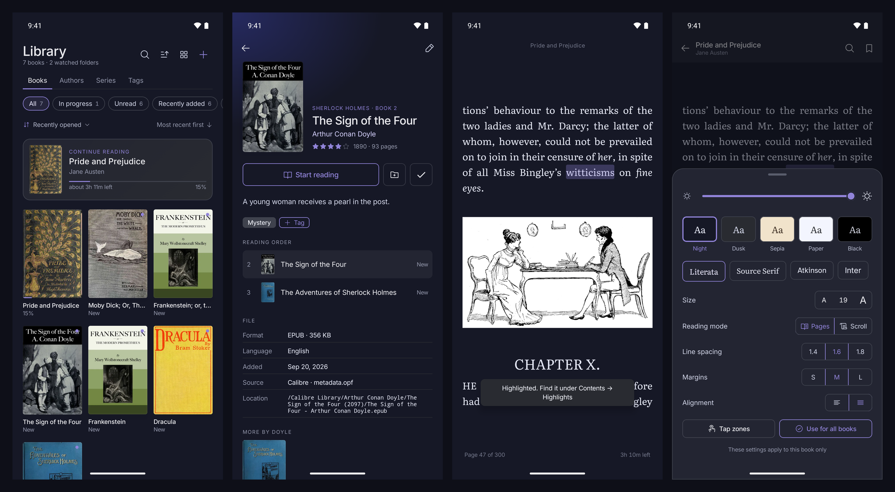

</div>

Quire is a quiet replacement for Librera and Moon+ Reader. It watches the folders where you keep your books, understands the metadata Calibre writes next to them, and stays fast with a thousand books or more. Reading comes first: pick a book, tap the edges to turn pages, and get on with it.

## Features

### Your library, without the import step
- **Point it at folders.** Quire finds EPUBs in your Calibre library, `Books`, `Downloads`, or any folder you choose, and picks up new files on its own (when you open the app, and every six hours in the background).
- **Calibre-aware.** Reads each book's `metadata.opf` and `cover.jpg`: series and book number, tags, ratings, description, and the date you added it. Your Calibre library is never modified.
- **Fast at scale.** About 100 books a second on first scan; a rescan with nothing changed takes half a second for 1,500 books. Only new or changed files are read.
- **Browse the way you think.** Books, Authors (with an A–Z rail), Series (with the volumes you're missing), and Tags. Grid, dense list or shelves; sort by recently opened, date added, publication date, file size or length; filter and search across titles, authors, series and tags.
- **Picks up where you left off.** A "Continue reading" card with time left, and every book remembers its place.

### A reader that stays out of the way
- **Real EPUB rendering** through the [Readium toolkit](https://github.com/readium/kotlin-toolkit): images, tables, footnotes, internal links and publisher CSS all work.
- **Tap zones.** Left edge back, right edge forward, middle for the controls.
- **Pages or scroll.** In scroll mode chapters run into each other, so there's no sideways swipe to change chapter.
- **Make it yours.** Five themes including **AMOLED Black** (true `#000000`), four fonts (Literata, Source Serif, Atkinson Hyperlegible, Inter), size, line spacing, margins, alignment, and a brightness dimmer. Set your **reading defaults** once in Settings (theme, font, size, spacing, margins, alignment, pages or scroll) with a live preview; any single book can override them, and "Back to my defaults" undoes that.
- **Highlights, notes and bookmarks.** Select text to highlight it or attach a note; everything is listed in one place and tied to the page.
- **Search the whole book.** Results stream in as they are found, and the matches are underlined on the page.
- **Contents with real page numbers**, even for books that keep every chapter in one file.

## Screenshots

| Welcome | Pick folders | Library ready |
|:---:|:---:|:---:|
| 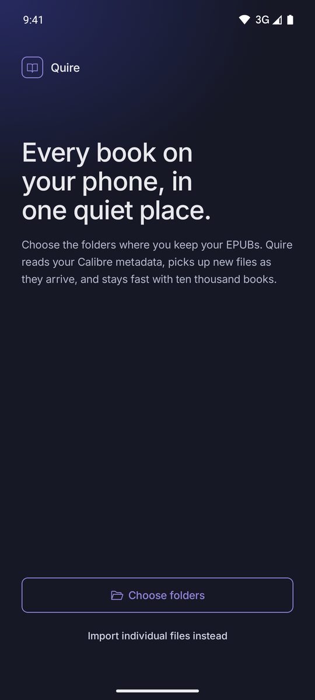 | 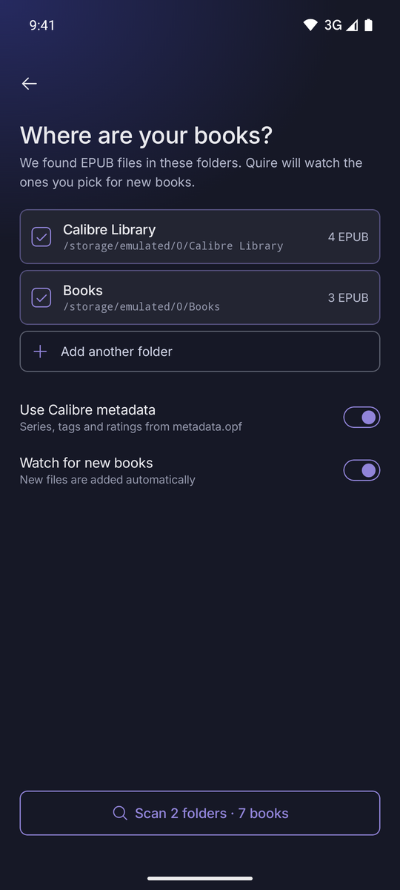 | 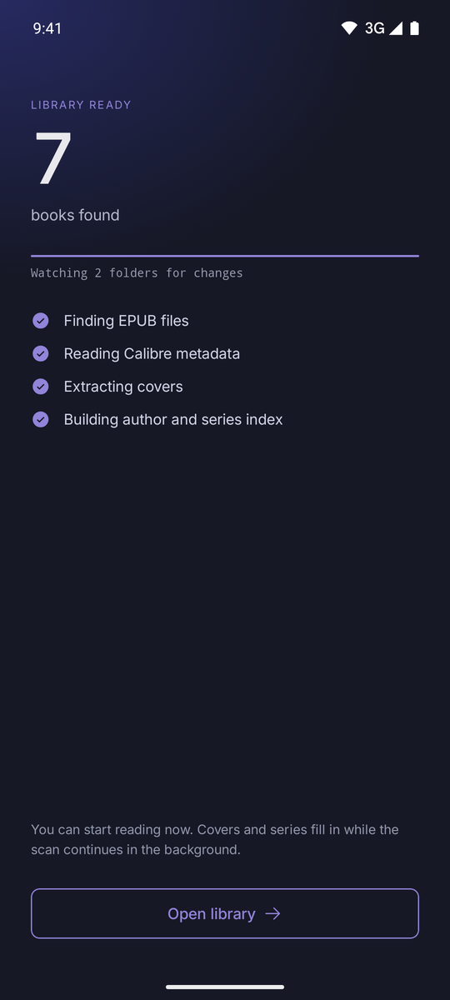 |

| Library | Shelves | Dense list |
|:---:|:---:|:---:|
| 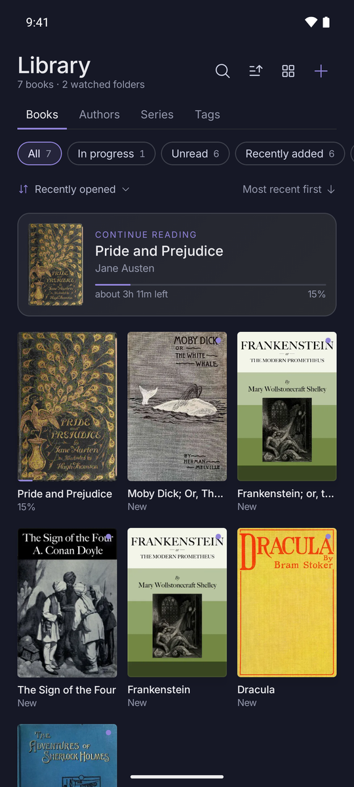 | 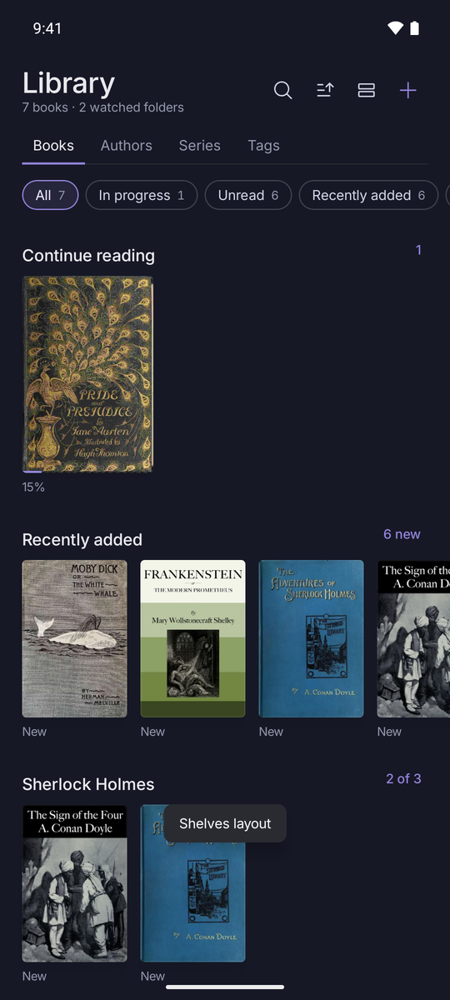 | 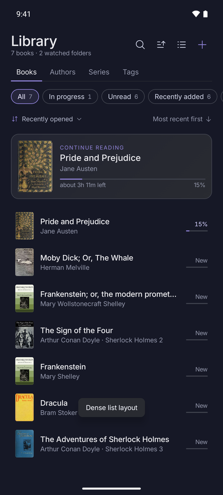 |

| Authors | Series | Tags |
|:---:|:---:|:---:|
| 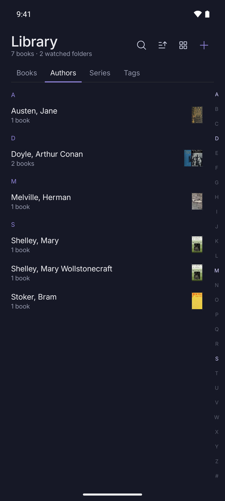 | 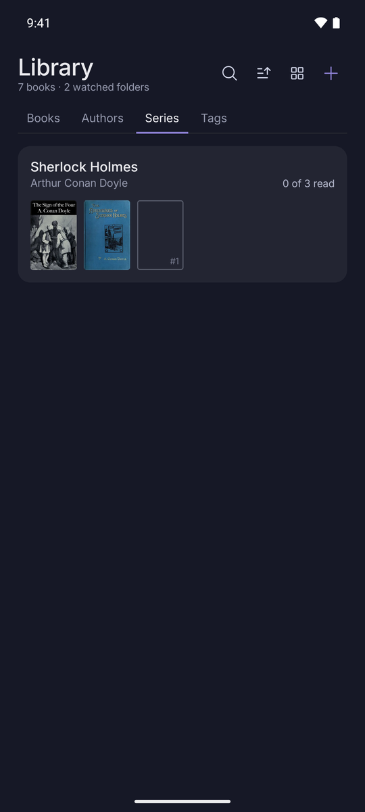 | 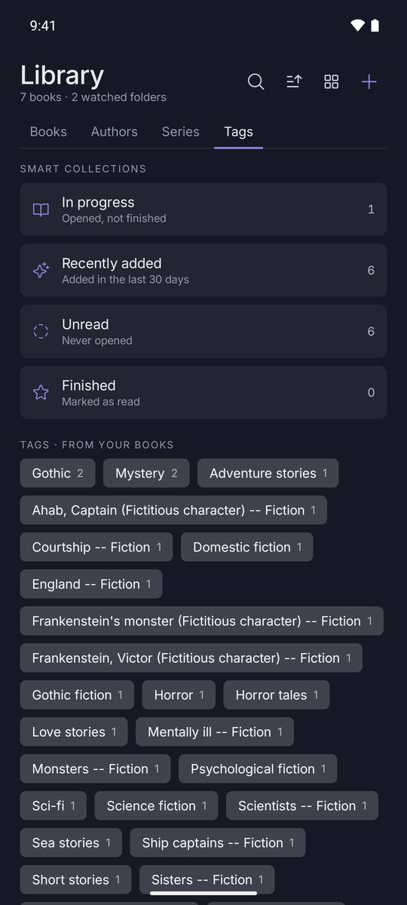 |

| Book page | Sort | Add books |
|:---:|:---:|:---:|
| 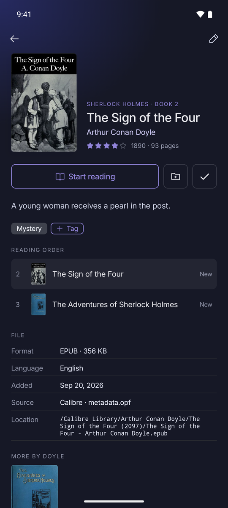 | 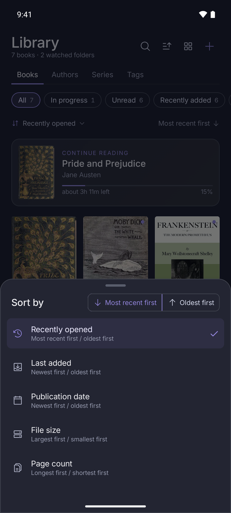 | 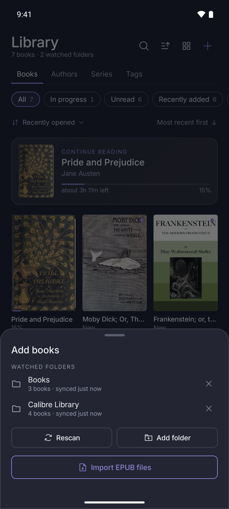 |

| Reading | AMOLED Black | Display settings |
|:---:|:---:|:---:|
| 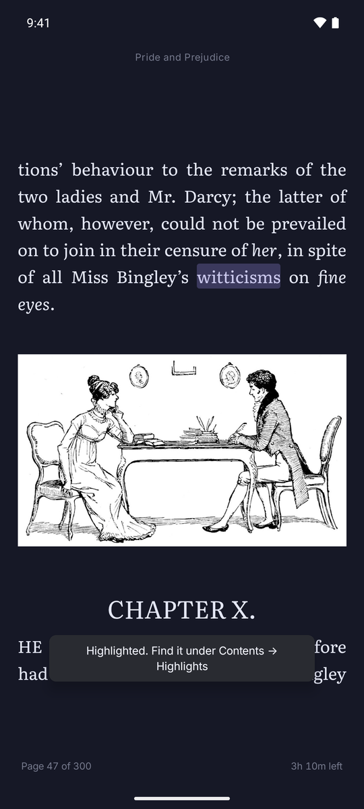 | 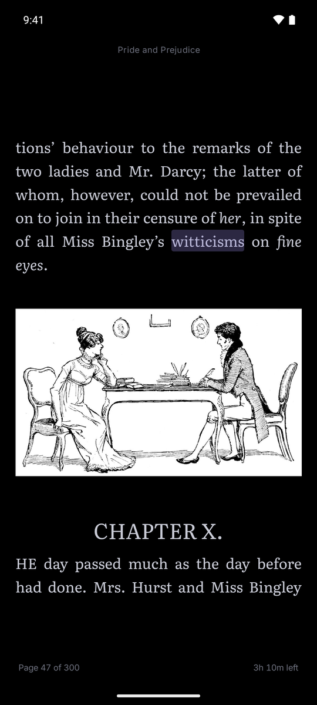 | 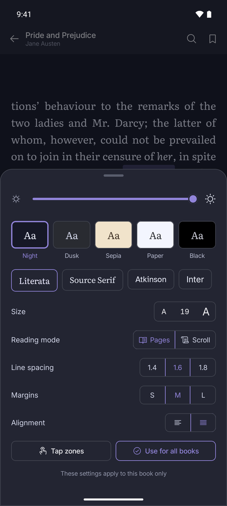 |

| Contents | Search in book |
|:---:|:---:|
| 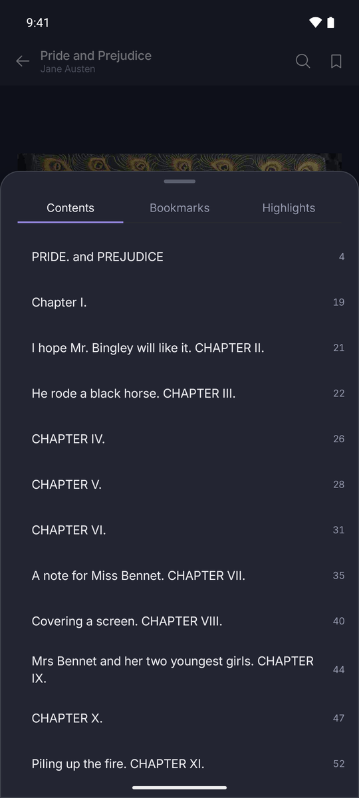 | 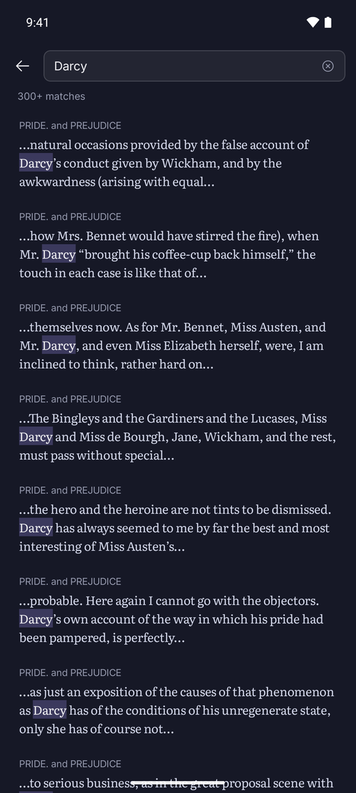 |

## Install

Every push builds a debug APK. Open the latest run on the [Actions tab](https://github.com/sekhnat/Quire/actions/workflows/build.yml), download the **quire-debug-apk** artifact, and install it. Tagged releases (`v*`) attach the APK to a [GitHub release](https://github.com/sekhnat/Quire/releases).

On first launch Quire asks for **All files access**. This is a single switch in Android's settings, and it is what lets Quire read your Calibre folder in place and notice new books. Nothing leaves your phone: Quire has no network features and no account.

## Build from source

You need JDK 21 and the Android SDK (platform 36, build tools 36.0.0).

```sh
./gradlew assembleDebug test lint     # build, run the unit tests, lint
./gradlew installDebug                # install on a connected device or emulator
```

The APK lands in `app/build/outputs/apk/debug/app-debug.apk`.

To try it on an emulator, grant access and put some books on the device:

```sh
adb shell appops set com.quire.reader MANAGE_EXTERNAL_STORAGE allow
adb push my-books/ /sdcard/Books/
```

## How it's put together

```
app/src/main/java/com/quire/reader/
├── data/
│   ├── db/        Room: books, tags, reading state, bookmarks, highlights
│   ├── scan/      folder scanner, Calibre OPF parser, cover thumbnails, background worker
│   ├── LibraryRepository.kt, SettingsStore.kt, ReaderPrefs.kt
├── reader/        Readium wrapper: session, navigator host, preferences, continuous scrolling
├── theme/         Nocturne design tokens, fonts, reader themes
└── ui/            Compose screens: onboarding, library, book page, reader
```

- **Kotlin and Jetpack Compose**, with a single `ViewModel` holding screen state.
- **Room** stores the library; sorting, filtering and grouping happen over the in-memory list, which is instant at this scale.
- **Readium 3.3** parses and renders EPUBs. It is pinned because 3.4 needs compileSdk 37, which the current Android Gradle Plugin does not support.
- The scanner skips unchanged files by size and modified time, reads the rest four at a time, and never lets one broken file stop the run. A folder that has gone missing (an unmounted SD card) never removes its books from the library.

## Design

The interface follows the Quire Reader design from Claude Design, built on the **Nocturne** design system: a near-neutral blue-grey ground, Inter at medium weight, soft 8 px corners, and a single blurple accent used as a line and a glow rather than a flood. Icons are [Phosphor](https://phosphoricons.com).

## Not built yet

- Writing edits back to Calibre. Tags, ratings and "finished" set inside Quire stay in Quire's own database.
- Formats other than EPUB, and DRM-protected books.
- Importing your own fonts.

## Credits

[Readium](https://readium.org) for EPUB parsing and rendering · [Phosphor Icons](https://phosphoricons.com) · Literata, Source Serif, Atkinson Hyperlegible and Inter (open fonts, SIL OFL) · sample books from [Project Gutenberg](https://www.gutenberg.org).
